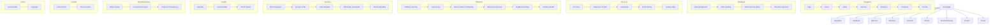

```mermaid
flowchart TD
    A[Homepage] --> B[Navigation]
    A --> C[Masthead]
    A --> D[About Us]
    A --> E[Ministries]
    A --> F[Sermons]
    A --> G[Events]
    A --> H[Donations/Giving]
    A --> I[Contact]
    A --> J[Footer]

    subgraph Navigation
        B1[Logo] --> B2[Home]
        B2 --> B3[About]
        B3 --> B4[Sermons]
        B4 --> B5[Ministries]
        B5 --> B6[Donations]
        B6 --> B7[Contact]
    end

    subgraph Masthead
        C1[Video Background] --> C2[Main Heading]
        C2 --> C3[Watch Sermon Button]
        C3 --> C4[View More Sermons]
    end

    subgraph About Us
        D1[Our Story] --> D2[Statement of Faith]
        D2 --> D3[Leadership]
        D3 --> D4[Photo Gallery]
        D4 --> D5[Location Map]
    end

    subgraph Ministries
        E1[Children's Ministry] --> E2[Youth Group]
        E2 --> E3[Women's/Men's Fellowship]
        E3 --> E4[Outreach & Missions]
        E4 --> E5[Kingdom Meetings]
        E5 --> E6[Ministry Modals]
    end

    subgraph Sermons
        F1[Filter Categories] --> F2[Sermon Cards]
        F2 --> F3[Video Embeds]
        F3 --> F4[PDF/Audio Downloads]
        F4 --> F5[Devotionals Blog]
    end

    subgraph Events
        G1[Calendar] --> G2[Event Modals]
        G2 --> G3[RSVP System]
    end

    subgraph Donations/Giving
        H1[Online Giving] --> H2[Recurring Donations]
        H2 --> H3[Financial Transparency]
    end

    subgraph Contact
        I1[Contact Form] --> I2[Phone Contact]
    end

    subgraph Footer
        J1[Social Media] --> J2[Copyright]
    end

    click C3 "https://www.youtube.com/embed/QxQIr5SOKjE" _blank
    click J1 "https://www.facebook.com/maurice.oloo" _blank
```
